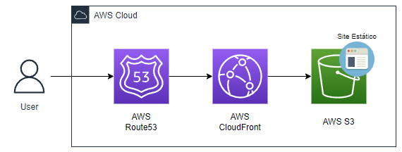

<h1 class="page-title">Site Estático com CloudFront e Route53</h1>

</header>
<h1 id="cb76ffc4-3f1f-4150-b7be-22a09fff6d23" class="">Introdução</h1>
Esta documentação descreve as etapas necessárias para a criação de um site estático com baixa latência e altamente disponível, além de maior nível de segurança por meio do protocolo HTTPS.

<h1 id="d18293ee-235c-4f19-a92a-1163d5b8e2cb" class="">Explicação das Ferramentas/Serviços</h1><ul id="cabad578-1498-4d8c-ba5a-938ecaf7b3e4" class="bulleted-list"><li style="list-style-type:disc">AWS S3 – É um serviço de armazenamento de objetos que oferece escalabilidade, disponibilidade de dados, segurança e performance líderes do setor. Clientes de todos os portes e setores podem armazenar e proteger qualquer quantidade de dados de praticamente qualquer caso de uso, como data lakes, aplicações nativas da nuvem e aplicações móveis.</li></ul>

<ul id="a479cd44-c224-479e-9b6f-0390501a62b2" class="bulleted-list"><li style="list-style-type:disc">AWS CloudFront – O Amazon CloudFront é um serviço de rede de entrega de conteúdo (CDN) criado para alta performance, segurança e conveniência do desenvolvedor.</li></ul>

<ul id="7df3bbb0-6485-4c7f-84ce-6a2b940532ba" class="bulleted-list"><li style="list-style-type:disc">AWS Route53 – O Amazon CloudFront é um serviço de rede de entrega de conteúdo (CDN) criado para alta performance, segurança e conveniência do desenvolvedor.</li></ul>

<h1 id="00a11b42-03c8-4a74-a8a8-186e99ef9fda" class="">Pré-requisitos do Projeto</h1><ul id="6ba011b9-1931-45d6-b397-262f97369fb4" class="bulleted-list"><li style="list-style-type:disc">Uma conta ativa da AWS</li></ul><ul id="9f54aa1a-b8a6-41c1-b4dc-7fc43666d1fb" class="bulleted-list"><li style="list-style-type:disc">Conhecimento básico dos serviços da AWS</li></ul><ul id="cde9f679-44bd-42bf-9dbe-315c41cb4af4" class="bulleted-list"></ul>

<h1 id="1ee70352-9203-49f7-bb15-7926fef65f04" class="">Etapas do Projeto</h1><ol type="1" id="e40f357a-b34b-49c0-bd6e-9125ee0dc3ec" class="numbered-list" start="1"><li>Criação da Página Estática</li></ol><ol type="1" id="37bcdb8d-f53f-463f-9fbf-071153ccf7e7" class="numbered-list" start="2"><li>Criação do Bucket no S3</li></ol><ol type="1" id="d4eb1510-d96f-4e61-9482-12b8e8907973" class="numbered-list" start="3"><li>Configuração do Bucket no S3 para Site Estático</li></ol><ol type="1" id="d250bae5-c9f3-416b-af6a-4a2647b39f2c" class="numbered-list" start="4"><li>Configuração do AWS CloudFront</li></ol><ol type="1" id="d29fde6c-d4e1-4d4b-8bc4-35f6ac0af8d9" class="numbered-list" start="5"><li>Configuração do Route53</li></ol>

<h1 id="2951fb42-0c1d-494b-9df5-b1fda979164b" class="">Arquitetura</h1><figure id="35cbce0f-c85a-4f81-a45c-7643f8dceb3d" class="image" style="text-align:left"></figure><h1 id="4e162ca6-d75d-4a97-b08d-6352c87d72d6" class="">Passo-a-Passo do Projeto</h1>

<h2 id="9670b7fd-0aee-40b1-8891-3da59a8e0734" class="">1. Criação da Página Estática</h2>
O objetivo do projeto é voltado para criação da estrutura dentro da AWS, então não entrarei em mais detalhes sobre a construção da página em HTML ou o CSS da mesma. Caso você queira utilizar um modelo pronto, na pasta de “Resume” você pode conferir o que foi feito para esse projeto.

<h2 id="a76303a7-677e-4d19-8186-8f587d1b15d2" class="">2. Criação do Bucket no S3</h2>
Nós iremos fazer a criação de um Bucket no S3, para que possamos colocar o nosso arquivo HTML e CSS, para hospedagem do nosso site estático. As etapas são as seguintes:
<ol type="1" id="82166539-4128-45bf-8ffe-ad310f1f17fa" class="numbered-list" start="1"><li>Busque pelo serviço de “S3” no buscador da AWS</li></ol><ol type="1" id="502c5258-4b03-41d9-bfe5-f6804da012d2" class="numbered-list" start="2"><li>Clique em “Create bucket”</li></ol><ol type="1" id="4956ea99-b647-41b3-a535-e67ce1e05485" class="numbered-list" start="3"><li>Escolha um nome de preferência para o seu Bucket</li></ol><ol type="1" id="88489fcd-110c-4f99-972a-f8576385c08e" class="numbered-list" start="4"><li>Escolha uma região mais adequada para ele</li></ol><ol type="1" id="5c910eaf-3622-4ca3-a4fd-9b248ea69a2a" class="numbered-list" start="5"><li>Pode manter o resto das configurações e então, ao final clicar em “Create Bucket”</li></ol>

Após a criação do Bucket, você pode utilizar os arquivos que disponibilizei na pasta de “Resume” e dar upload no diretório raiz desse seu bucket.

<h2 id="a954b0bd-cd53-40b6-ad6e-5cf39b733619" class="">3. Configuração do Bucket no S3 para Site Estático</h2>
Após a criação do seu Bucket do S3, precisamos configurar o mesmo, para que ele possa hospedar uma página estática na web. Segue abaixo o passo a passo:
<ol type="1" id="398fd3f0-5caa-4fef-a7a4-6a93034296f5" class="numbered-list" start="1"><li>Ainda na página que mostra os seus ‘buckets’. Clique no bucket que você escolheu para esse projeto</li></ol><ol type="1" id="2c01f168-4816-4a3d-8ff6-640199de8d2b" class="numbered-list" start="2"><li>Clique na aba de “Permissions”</li></ol><ol type="1" id="e0a3bdf2-15e5-4221-821e-a2074361cff6" class="numbered-list" start="3"><li>Busque pela seção de “Block public access (bucket settings<strong><strong>)</strong></strong>”, e então clique em “Edit”</li></ol><ol type="1" id="c4ed8d79-5454-4998-8498-a288354bd4f0" class="numbered-list" start="4"><li>Desmarque o box que diz “Block public access (bucket settings)”. Salve as mudanças.</li></ol><ol type="1" id="641e8f71-cc83-4399-9e93-1abdff8a0818" class="numbered-list" start="5"><li>Ainda em “Permissions”, busque pela seção de “Bucket Policy”. E coloque a seguinte política:</li></ol><pre id="a5f7e4ed-dafa-4db5-b050-574471f3b827" class="code"><code>{
    &quot;Version&quot;: &quot;2012-10-17&quot;,
    &quot;Statement&quot;: [
        {
            &quot;Sid&quot;: &quot;PublicReadGetObject&quot;,
            &quot;Effect&quot;: &quot;Allow&quot;,
            &quot;Principal&quot;: &quot;*&quot;,
            &quot;Action&quot;: &quot;s3:GetObject&quot;,
            &quot;Resource&quot;: &quot;arn:aws:s3:::BUCKET-NAME-HERE/*&quot;
        }
    ]
}</code></pre><ol type="1" id="4a2d8ecc-5bce-4b92-9c28-33142598131a" class="numbered-list" start="6"><li>Só precisa alterar na política onde tiver “BUCKET-NAME-HERE”, e você coloca o nome do seu Bucket. Salve as mudanças.</li></ol><ol type="1" id="112eaaf6-8945-4ad9-be36-a060b6183286" class="numbered-list" start="7"><li>Mude da aba de “Permissions” para a aba de “Properties”, busque pela seção de “Static website hosting”, clique em editar.</li></ol><ol type="1" id="6ac507ba-94c4-4f56-9b72-23de02125770" class="numbered-list" start="8"><li>Altere a opção de “Static website hosting” para Enable.</li></ol><ol type="1" id="48df2960-2e7d-499a-aa5a-64f4341b9c8c" class="numbered-list" start="9"><li>E então, caso esteja utilizando o documento HTML que disponibilizei nesse projeto. No campo de “Index document”, coloque “detailed-resume.html” e no campo de “Error document”, adicione “error.html”.</li></ol><ol type="1" id="38743d28-cf99-4981-8901-dc4c3604fe9c" class="numbered-list" start="10"><li>Por final salve as alterações.</li></ol>

<h2 id="1f8b78ec-aad4-4103-b5cd-d84129652fa8" class="">4. Configuração do AWS CloudFront</h2>
Nesse momento, você já consegue acessar o seu site estático utilizando o link de acesso que o Bucket do S3 disponibiliza para você. 

Porém, iremos fazer a criação de uma distribuição na AWS CloudFront para melhorar o tempo de resposta do site, principalmente em casos que o usuário tente acessar em outras regiões do mundo além da região que está localizado o servidor em que nosso Bucket no S3 está hospedado. Da seguinte forma:
<ol type="1" id="3b5ac633-d9b6-47ba-ad30-fe3700fefa60" class="numbered-list" start="1"><li>Busque pelo serviço de “CloudFront” no buscador da AWS</li></ol><ol type="1" id="f8c991ea-3510-45b5-8cb1-3f3ba3caea5b" class="numbered-list" start="2"><li>Em “distributions”, clique em “Create distribution”</li></ol><ol type="1" id="96a887f3-3315-4528-996f-6674cf68aaaf" class="numbered-list" start="3"><li>No campo de “Origin domain”, selecione o domínio que seu Bucket do S3 está hospedando seu site estático. (Durante a configuração de habilitação de site estático do bucket, é liberado um endpoint de acesso ao site estático, utilize ele neste campo)</li></ol><ol type="1" id="8c446e40-ab31-428b-aafd-61648119ce73" class="numbered-list" start="4"><li>Descendo o setup da sua distribuição do CloudFront, busque pelo campo de “Default root object” e nele coloque o nome do nosso arquivo que será nosso index: “detailed-resume.html”.</li></ol><ol type="1" id="f9dbd97c-4bfb-4b7e-a4df-d091b62567d9" class="numbered-list" start="5"><li>E então pode clicar em “Create distribution”</li></ol>

<h2 id="48bc105c-c509-45e7-be60-bffee7fd99b7" class="">5. Configuração do Route53</h2>
Apesar da termos melhorado o tempo de resposta do nosso site estático, a URL do site ainda não está amigável. E também nossa distribuição do CloudFront ainda disponibiliza um endpoint de protocolo HTTP, logo, ainda não é a forma mais segura de acesso.

Desta forma, utilizaremos o Route53 para garantirmos um acesso mais seguro e uma URL mais amigável por meio de um DNS. Só relembrando que é necessário ter realizado a compra de um domínio no Route53 para conseguir ir adiante nesse próximo passo a passo:
<ol type="1" id="f13e1121-fc7f-40b2-a232-f08f1551ef3b" class="numbered-list" start="1"><li>Após você ter feito a compra do seu domínio no serviço “Route 53” da AWS, iremos partir para a configuração da nossa distribuição no CloudFront com um DNS.</li></ol><ol type="1" id="f83094dd-915a-45f9-880b-d68a79add94b" class="numbered-list" start="2"><li>Busque pelo serviço de “CloudFront” no buscador da AWS</li></ol><ol type="1" id="2027a2b9-cbdd-41cb-a1dc-a58a70a58c4f" class="numbered-list" start="3"><li>Clique na distribuição que você criou</li></ol><ol type="1" id="d06f60aa-27e9-4c75-a186-3a71e19ca35f" class="numbered-list" start="4"><li>Ainda na aba de “General”, busque pela seção de “Settings” e clique em editar.</li></ol><ol type="1" id="cef27935-1ea8-41af-b14c-1c0bb5cbb1c4" class="numbered-list" start="5"><li>No campo de “Alternate domain name (CNAME) - optional”, adicione o domínio que você adquiriu na “Route 53”.</li></ol><ol type="1" id="b3c50b89-6904-4c98-8b17-896cf4fe72f4" class="numbered-list" start="6"><li>E logo em baixo, terá outro campo de “Custom SSL certificate - optional”, nele você clicará no link em baixo do campo de “request certificate”. Você será direcionado para outra aba.</li></ol><ol type="1" id="c6f4dea4-d35b-490d-8266-dc3adfc27a3a" class="numbered-list" start="7"><li>Clique em “Next”. E depois adicione o seu domínio no campo de “Fully qualified domain name”. Clique em “Request” ao final.</li></ol><ol type="1" id="6c9602dd-5e77-470e-b6b1-29d63b41d10e" class="numbered-list" start="8"><li>Você perceberá que a sua solicitação estará pendente, clique nela.</li></ol><ol type="1" id="6ca29357-2fa3-44cb-9ab4-abad6fc36801" class="numbered-list" start="9"><li>Busque pela seção de “Domains” e clique em “Create records in Route 53”.</li></ol><ol type="1" id="8fb75c47-4dfa-416a-95a1-dbbb4b160d67" class="numbered-list" start="10"><li>Após alguns minutos estará como “Issued” a sua certificação SSL do seu domínio.</li></ol><ol type="1" id="902de92e-15ed-4196-a789-d738848a9459" class="numbered-list" start="11"><li>Retorne para a aba do “CloudFron” e então clique no botão de refresh ao lado do campo de “Custom SSL certificate - optional”, irá aparecer o certificado SSL do seu domínio. Selecione ele.</li></ol><ol type="1" id="1b346778-80f5-4759-8745-442c8ccb321d" class="numbered-list" start="12"><li>E então, clique em “Save Changes”</li></ol>

<h1 id="49530110-7271-490c-891c-3aa4af2f9516" class="">Conclusão</h1>
Após a realização desse passo a passo, você conseguirá ter um site estático no ar, utilizando uma URL mais amigável, segura e com tempo de resposta bem melhor para os seus usuários. Facilitando acessos de outras localidades do mundo.

</article></body></html>
